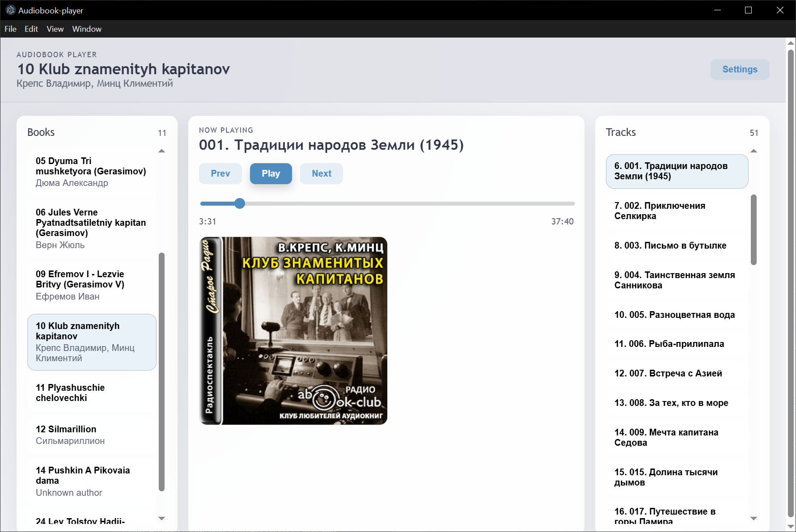

# Audiobook Player

A cross-platform desktop audiobook player built with React, Vite, and Electron. It scans a local library folder, treats each top-level folder as a book, and plays chapters with a focused, offline-first UI.

## Features

- Local library scanning (one folder, multiple book subfolders)
- Playback with track navigation and seek
- Metadata extraction (author + cover art) when available
- Light/dark theme toggle
- Playback auto-advance

## Demo



## Library Layout

The app expects one **library folder**, with **top-level subfolders** for each book. Subfolders inside a book are treated as part of that same book.

```
Library/
├── Book One/
│   ├── 01 - Chapter 1.mp3
│   └── Part 1/
│       └── 02 - Chapter 2.mp3
└── Book Two/
	└── 01 - Chapter 1.mp3
```

## Development

Install dependencies:

```bash
npm install
```

Run the renderer dev server:

```bash
npm run dev
```

## Notes

- Metadata parsing uses `music-metadata` in the Electron main process.
- Book covers are stored as data URLs when embedded in files.
- Playback state and settings are stored in local storage.
